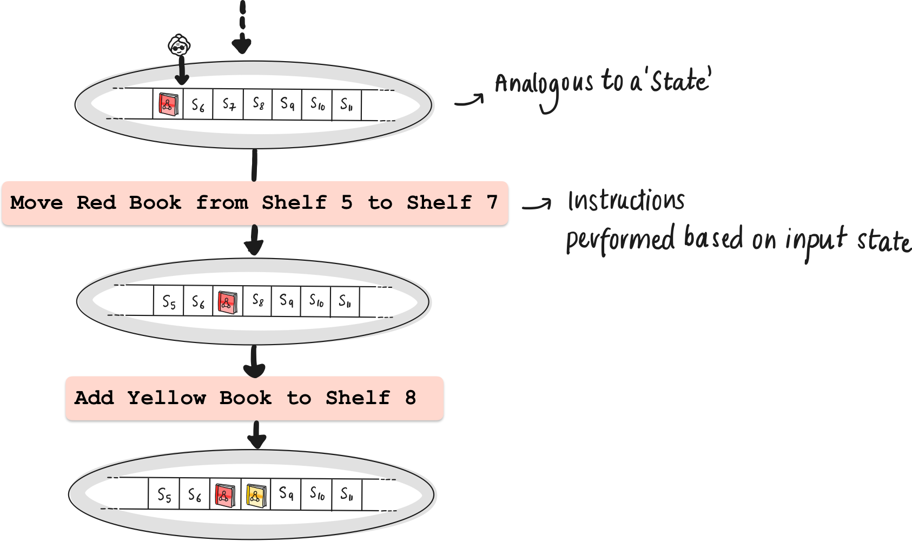
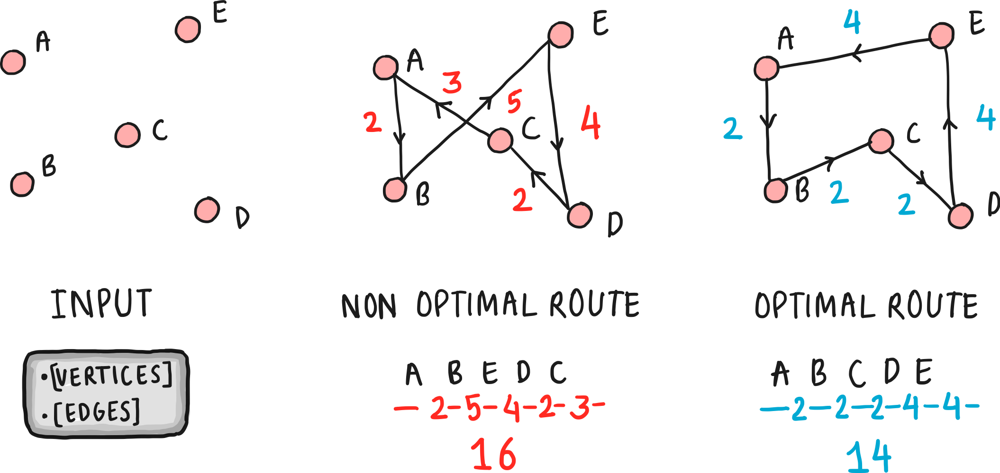

### Pre-requisites
1. [Language acceptance by Deterministic Finite Automata](https://virtual-labs.github.io/exp-determinstic-finite-automaton-iiith/)
2. [Non-determininistic Finite Automata (DFA)](https://virtual-labs.github.io/exp-non-determinstic-finite-automaton-iiith/)
3. [Pushdown Automata (PDA)](https://virtual-labs.github.io/exp-pushdown-automaton-iiith/)
4. [Deterministic Turing Machines (DTM)](https://virtual-labs.github.io/exp-deterministic-turing-machine-iiith/)

### Visualising Turing Machines

If you have read the previous article on Deterministic Turing Machines, you probably already have some idea about its workings. In this article, we dive a little deeper into Non Deterministic Turing Machines. To make it a little easier to imagine, let’s set up an analogy.

Imagine a Turing Machine as a librarian in an infinitely long 1D library. Each book (symbol) on the shelves (tape cells) named $S_i$  is subject to the librarian's assessment. Following a set of rules based on the librarian’s brain/mental state (the state table), the librarian moves along the shelves, reading and rearranging books, with each action determined by the current state and the book in hand. The librarian can place a book (symbol), overwrite, or delete it.

### **Non-Determinism**

**Note: This is fully theoretical, we cannot actually implement this in practice.**

In the deterministic case, each decision leads to a single outcome. Deterministic Turing Machines (DTMs) embody this linear, predictable path, where each step is a direct consequence of the previous one. DTMs offer a single pathway, while NDTMs present multiple potential pathways.

So far, it’s pretty simple. Given the current state of the library, and a the librarian’s position in the library (which shelf the librarian is visiting), or the position of the turing machine’s head on the tape, the next steps are well defined. What if the librarian has a choice of performing one of many actions in the given position?

Now, picture our librarian suddenly gaining the ability to replicate at each decision point, with each clone exploring a different shelf. This is the essence of non-determinism in Non-Deterministic Turing Machines (NDTMs). Each clone represents a different potential computation pathway, exploring various solutions in parallel.

It’s probably a little easier to understand why we cannot implement this in real life. It would require us to magically multiply our resources, and parallelise processes this way.

**Despite their differences, DTMs and NDTMs are two sides of the same coin, each capable of emulating the other, reflecting universal aspects of computational theory.**

In DFA, NFA, PDA’s, we remember transitioning from states using a state symbol. We represent each state using the current “snapshot” of the tape. The following could be understood as the state diagram for a deterministic turing machine.

<aside>
**How the NDTM might look from the outside**
In solving NP (Non-deterministic Polynomial time) problems, the machine's ability to 'guess' the correct path among many is crucial. It's like navigating a labyrinth with foreknowledge of the right turns. Almost like a wizard guiding the machine. Note that despite how it seems to know the correct path, this is simply because it parallelly traverses all the branches of computation. If we find a solution in any of the 

</aside>

### Language Hierarchy and Computability

We are already aware of the following relationship betweem automatons and the languages they recognise. Now, we can also add Turing Machines to this list.

DFA, NFA : Regular Languages

PDA: Context Free Grammars

Turing Machines: Turing Decidable Languages

Beyond the capabilities of NDTM’s : Recursively Enumerable Languages (Beyond the scope of the current article)

### Why should we talk about NDTM’s?

There are problems for which it is currently unknown whether deterministic Turing machines can find solutions in polynomial time. However, a Non Deterministic Turing Machine can do so. Hence NDTM’s motivate the definition of a class of problems called “NP”.

### Classes of Problems: P vs NP

1. **Class P:** The set of problems that can be computed/decided in polynomial time by a deterministic turing machine form the class “P”.
2. **Class NP**: The set of problems that any NDTM can solve in polynomial time. This includes all the problems that DTM’s can solve, and *possibly* more. This is quite a nuanced statement. 
    
    *Saying that NDTM’s can solve a set of problems more efficiently than DTM’s is not quite right: We haven’t proved that yet. In fact, it is currently an important open problem in theoretical computer science - “Is P = NP?”*
    
    The class NP can be defined in two ways, and we show the equivalence as follows.

    

### **NDTM solves in polynomial time = Solution Can be verified in polynomial time**

- **Equivalence of Statements**: The statement "problems solvable by NDTMs in polynomial time" is essentially equivalent to "problems verifiable by DTM’s in polynomial time".
    - Why? If an NDTM can solve a problem in polynomial time, it means there is a polynomial sized computation path where the NDTM guesses the correct solution. This directly implies that if we were to provide this guessed solution to a deterministic Turing Machine, it could verify the correctness of this solution in polynomial time, placing the problem in NP.
- **Fundamental Nature of NP**: The class NP is defined based on this verification capability. The fact that an NDTM can solve a problem in polynomial time is essentially the same as saying that a solution to the problem can be verified in polynomial time because the NDTM's ability to 'solve' the problem hinges on its capability to non-deterministically *always* 'traverse' the right solution path .

### Examples Problems in NP

### Sudoku

- **Description**: A puzzle where a 9x9 grid is divided into nine 3x3 subgrids and must be filled with numbers 1 through 9. Each row, column, and subgrid must contain all digits from 1 to 9 without repetition.
- **Relation to NP**: Sudoku falls into the NP category because any filled grid (a proposed solution) can be quickly verified for correctness. The verification involves checking rows, columns, and subgrids for the required conditions. However, finding the solution from scratch, especially for more complex puzzles, might not be efficiently achievable in polynomial time.

### Prime Factorization

- **Description**: This problem involves finding the prime factors of a given number. For example, the prime factorization of 15 is 3 and 5.
- **Relation to NP**: The complexity lies in decomposing a number into its prime factors, which can become computationally intensive as the number grows larger. However, once a set of factors is proposed, verifying that they are indeed the prime factors of the original number (by simply multiplying them together) is a task that can be accomplished efficiently, placing this problem in NP.

# Travelling Salesman Problem

Now, let's get into a specific problem that better motivates NDTM’s: the Traveling Salesman Problem (TSP), which is again a classic in Computer Science.

### The Travelling Salesman Problem: A Case Study in Non-Determinism

The Traveling Salesman Problem (TSP) is a classic problem in computer science and operations research. It's defined as follows:

- **Problem Statement**: Given a list of cities and the distances between each pair of cities, the task is to find the shortest possible route that visits each city exactly once and returns to the origin city.
- **Significance**: TSP is a prototypical NP-hard problem used to study optimization and computational complexity in algorithm design. It has practical applications in logistics, planning, and the manufacturing of microchips.

### Different Versions

### **Two Variants of TSP**

1. **Decision Version of TSP**:
    - **Problem Statement**: Given a list of cities, the distances between each pair of cities, and a number **`k`**, the question is: "Is there a route that visits each city exactly once, returns to the origin city, and has a total length less than or equal to **`k`**?"
    - **Class** **NP**: This version of TSP is a decision problem and is in NP. Why? Because if you're given a proposed route, you can quickly verify whether it visits each city once, returns to the origin, and has a total length ≤ **`k`**.
2. **Optimization Version of TSP**:
    - **Problem Statement**: Here, the goal is to find the shortest possible route that visits each city exactly once and returns to the origin city.
    - **Beyond NP**: Unlike the decision version, the optimization version asks for the 'best' solution (the shortest route) rather than a 'yes' or 'no' answer. It is not about verifying a given solution but finding the optimal one. Such problems are called NP Hard, which, roughly means “As hard as or harder than the hardest problems in NP”.

<aside>

💡 **NP-Hardness**

A problem is NP-hard if every problem in NP can be transformed into it in polynomial time. Essentially, NP-hard problems are as hard as or harder than the hardest problems in NP.

</aside>

### Final Takeaways

- It's important to note that NDTMs are theoretical constructs. In practical computing, we don't have machines that can genuinely process multiple paths simultaneously to the extent an NDTM can in theory.
- PDTM’s are not the same as NDTM’s. PDTM’s choose a branch of computation based on a probability distribution. So such a machine takes *one* path. An NDTM (theoretically) traverses all the diverging paths.

- Discussing non deterministic turing machines is helpful to examine problems such as “Is P = NP?”

